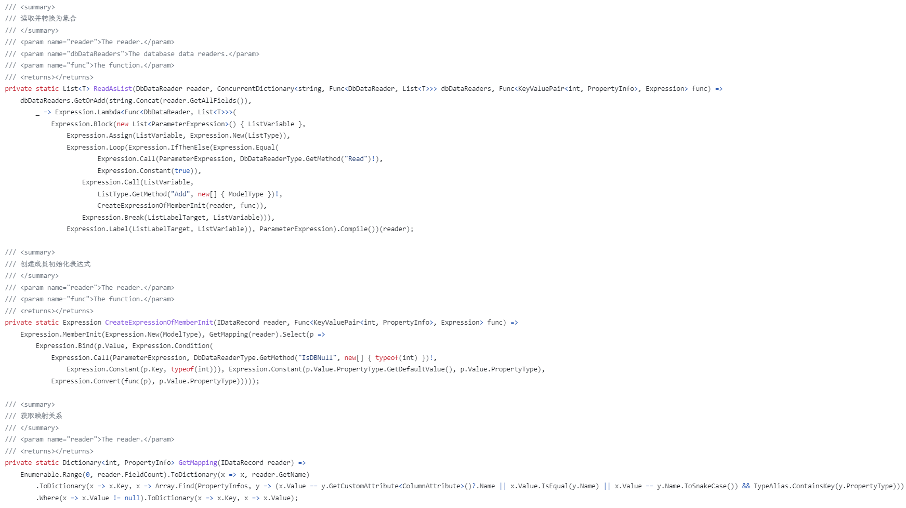

# NiuX.Extensions

整理的一些 C# 扩展方法。

## 信息

[NuGet Gallery | NiuX.Extensions 0.1.4](https://www.nuget.org/packages/NiuX.Extensions)

## 功能

- [利用表达式树操作数据库](https://github.com/liqingwen2015/NiuX.Extensions/blob/main/framework/NiuX.Extensions/NiuX/Data/DbDataReaderExtensions.cs)

